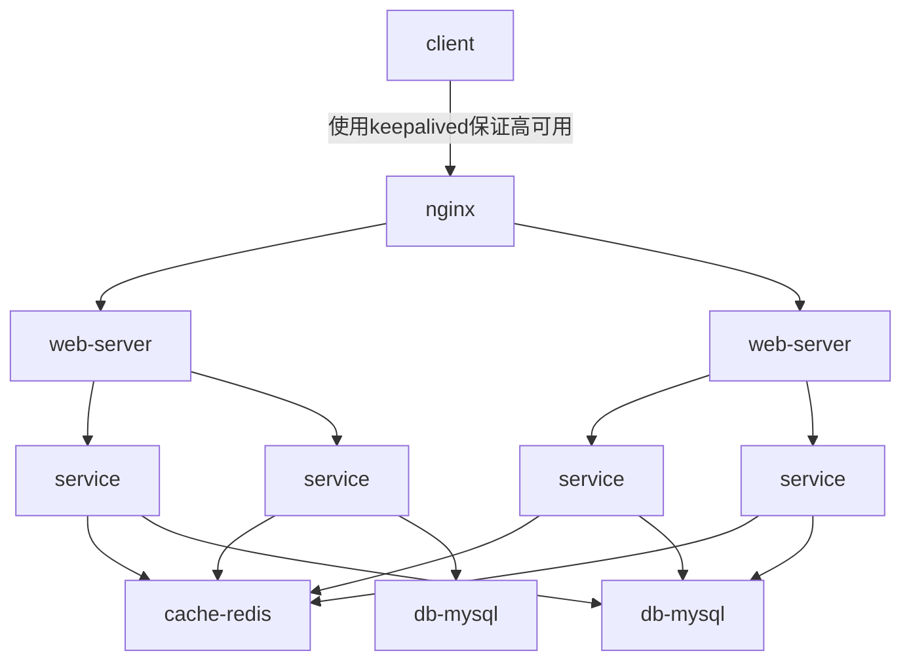

##### 20190317
>1、用Java做一个大流量、高并发的网站应该怎么样进行底层构架？采用哪些框架技术比较适合？
* **大流量、高并发理解：**
  首先大流量访问会产生高并发问题，高并发问题就是因为大流量访问引起的，两个是相互关联的。-

* **高并发：**
  高并发（High Concurrency）是互联网分布式系统架构设计中必须考虑的因素之一，它通常是指，通过设计保证系统能够同时并行处理很多请求。

* **衡量指标：**
  常用的有响应时间，吞吐量，每秒查询率QPS，并发用户数。
  `响应时间`：系统对请求做出响应的时间。例如系统处理一个HTTP请求需要200ms，这个200ms就是系统的响应时间。
  `吞吐量`：单位时间内处理的请求数量。
  `QPS`：每秒响应请求数。在互联网领域，这个指标和吞吐量区分的没有这么明显。
  `并发用户数`：同时承载正常使用系统功能的用户数量。例如一个即时通讯系统，同时在线量一定程度上代表了系统的并发用户数。

* **分布式架构**
&emsp;&emsp;提高系统并发能力的方式，方法论上主要有两种：垂直扩展（Scale Up）与水平扩展（Scale Out）。前者垂直扩展可以通过提升单机硬件性能，或者提升单机架构性能，来提高并发性，但单机性能总是有极限的，互联网分布式架构设计高并发终极解决方案还是后者：水平扩展。
&emsp;&emsp;分布式架构+负载均衡支持是高并发网站的主要选择的解决方案。
**常见分布式架构分层**：反向代理层、站点应用层、服务层、数据-缓存层、数据-数据库层。
**设计原则**：每层都有可以分流的可能，多级分流。是根据并发量，进行不同程度的每层的水平扩展。各层实施水平扩展后，能够通过增加服务器数量的方式来提升系统的性能，做到理论上的性能无限。
**最终选择**：分布式架构分层设计是解决高并发的主要方案。
* **分布式架构分层设计(或者扩展)**
**反向代理层水平扩展**：
&emsp;&emsp;是通过“DNS轮询”实现的：dns-server对于一个域名配置了多个解析ip，每次DNS解析请求来访问dns-server，会轮询返回这些ip。
&emsp;&emsp;当nginx成为瓶颈的时候，只要增加服务器数量，新增nginx服务的部署，增加一个外网ip，就能扩展反向代理层的性能，做到理论上的无限高并发。
**站点应用层的水平扩展**：
&emsp;&emsp;站点web应用层的水平扩展，是通过“nginx”实现的。通过修改nginx.conf，可以设置多个web后端。
&emsp;&emsp;当web后端成为瓶颈的时候，只要增加服务器数量，新增web服务的部署，在nginx配置中配置上新的web后端，就能扩展站点层的性能，做到理论上的无限高并发。
**服务层的水平扩展**：
&emsp;&emsp;站点层通过RPC-client调用下游的服务层RPC-server时，RPC-client中的连接池会建立与下游服务多个连接，当服务成为瓶颈的时候，只要增加服务器数量，新增服务部署，在RPC-client处建立新的下游服务连接，就能扩展服务层性能，做到理论上的无限高并发。如果需要优雅的进行`服务层自动扩容`，这里可能需要配置中心里服务自动发现功能的支持。
**数据层的水平扩展**：
&emsp;&emsp;在数据量很大的情况下，数据层（缓存，数据库）涉及数据的水平扩展，将原本存储在一台服务器上的数据（缓存，数据库）水平拆分到不同服务器上去，以达到扩充系统性能的目的。
* **分层架构图**

* **框架选择**
dubbo：rpc框架，可以很好实现，服务层自动扩容。
其它正在学习......

