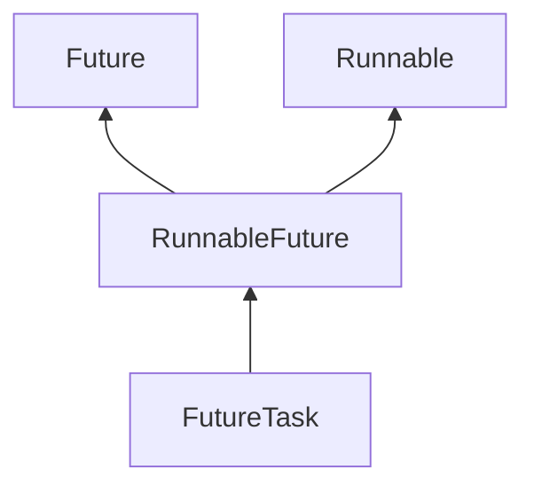

# 1、Java中的同步集合与并发集合有什么区别？

- 为什么需要同步和并发集合
  - 普通集合没有添加同步和并发控制，在多线程环境下不是线程安全的。为了解决线程安全问题，于是出现了同步和并发集合。
- 同步集合与并发集合

​	所谓同步集合和并发集合，差异主要在同步和并发上。同步即使用synchronize锁的方式来达到线程安全。而并发则不同。它可以与同步集合一样使用synchronize来达到线程安全，但进行优化引入了segment（分段锁）的概念。因此性能比synchronize的要高。同样也可以使用CopyOnWrite技术，达实现多线和安全效果。

# 2、Java中invokeAndWait 和 invokeLater有什么区别？

- 相同点

  都是将代码交给另一个线程(EDT)去处理，并且是有序的

- 不同点

  `invokeLater`是异步非阻塞模式的，不需要等待代码执行结果就返回继续往下执行。

  `invokeAndWait`从名字可以看出来，需要等待执行结果。

# 3、什么是FutureTask？

首先看看FutureTask继承关系图：

从图中可知FutureTask实现了RunnableFuture接口，而RunnableFuture继承了Runnable和Future，也就是说FutureTask既是Runnable，也是Future。

FutureTask个人认为有两个相对于传统的Thread或者Runnable接口，比较有特色特性如下：

1. 有返回值，可以获取执行结果
2. 任务可以取消